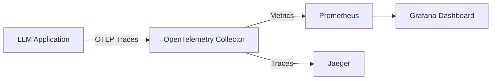

# Lab M-06: End-to-End Observability for Managed LLMs

## Objective
Implement comprehensive observability for managed LLM workloads to track token consumption, latency, error rates, and estimated costs in real-time.

## Prerequisites
- Python 3.9+
- `opentelemetry-api`, `opentelemetry-sdk`, `opentelemetry-exporter-otlp`
- Access to a managed LLM provider (OpenAI/Azure/AWS)
- Docker Compose (for local Jaeger/Prometheus stack)

## Architecture


## Implementation Steps

### 1. Instrumentation Wrapper
Create a wrapper around your LLM client to capture metrics automatically.

```python
# observability_wrapper.py
import time
import os
from opentelemetry import trace, metrics
from opentelemetry.sdk.trace import TracerProvider
from opentelemetry.sdk.metrics import MeterProvider
from opentelemetry.sdk.trace.export import BatchSpanProcessor
from opentelemetry.exporter.otlp.proto.grpc.trace_exporter import OTLPSpanExporter
from opentelemetry.exporter.otlp.proto.grpc.metric_exporter import OTLPMetricExporter

# Initialize SDKs
trace.set_tracer_provider(TracerProvider())
tracer = trace.get_tracer("llm.finops")

meter_provider = MeterProvider()
metrics.set_meter_provider(meter_provider)
meter = metrics.get_meter("llm.finops")

# Define Metrics
token_counter = meter.create_counter("llm.tokens.total", description="Total tokens processed")
latency_histogram = meter.create_histogram("llm.latency.ms", description="Request latency in ms")
cost_counter = meter.create_counter("llm.cost.usd", description="Estimated cost in USD")

class ObservableLLM:
    def __init__(self, client, model_name, cost_per_1k_input=0.0005, cost_per_1k_output=0.0015):
        self.client = client
        self.model_name = model_name
        self.cost_in = cost_per_1k_input / 1000
        self.cost_out = cost_per_1k_output / 1000

    def generate(self, prompt):
        start_time = time.time()
        
        with tracer.start_as_current_span("llm.generate") as span:
            span.set_attribute("model", self.model_name)
            span.set_attribute("prompt.length", len(prompt))
            
            try:
                # Simulate API call
                response = self.client.chat.completions.create(
                    model=self.model_name,
                    messages=[{"role": "user", "content": prompt}]
                )
                
                end_time = time.time()
                latency = (end_time - start_time) * 1000
                
                # Extract usage
                input_tokens = response.usage.prompt_tokens
                output_tokens = response.usage.completion_tokens
                total_tokens = response.usage.total_tokens
                
                # Calculate Cost
                estimated_cost = (input_tokens * self.cost_in) + (output_tokens * self.cost_out)
                
                # Record Metrics
                token_counter.add(total_tokens, {"model": self.model_name, "type": "total"})
                latency_histogram.record(latency, {"model": self.model_name})
                cost_counter.add(estimated_cost, {"model": self.model_name})
                
                span.set_attribute("tokens.input", input_tokens)
                span.set_attribute("tokens.output", output_tokens)
                span.set_attribute("cost.usd", estimated_cost)
                
                return response.choices[0].message.content
                
            except Exception as e:
                span.record_exception(e)
                raise e
```

### 2. Local Observability Stack (Docker Compose)
Spin up a local stack to receive telemetry data.

```yaml
# docker-compose.yml
version: '3'
services:
  jaeger:
    image: jaegertracing/all-in-one:latest
    ports:
      - "16686:16686"
      - "4317:4317"
    environment:
      - COLLECTOR_OTLP_ENABLED=true

  prometheus:
    image: prom/prometheus:latest
    volumes:
      - ./prometheus.yml:/etc/prometheus/prometheus.yml
    ports:
      - "9090:9090"

  grafana:
    image: grafana/grafana:latest
    ports:
      - "3000:3000"
    environment:
      - GF_SECURITY_ADMIN_PASSWORD=admin
    volumes:
      - grafana_data:/var/lib/grafana
volumes:
  grafana_data:
```

### 3. Verification
1. Run `docker-compose up -d`.
2. Execute your Python script with `OTEL_EXPORTER_OTLP_ENDPOINT=http://localhost:4317 python app.py`.
3. Visit `http://localhost:16686` to see traces with cost attributes.
4. Visit `http://localhost:9090` to query `llm_cost_usd_total`.

## FinOps Insight
By tagging metrics with `model` and `environment`, you can slice cost data by feature team or product line, enabling precise chargeback/showback models.

## Cleanup
`docker-compose down -v`
