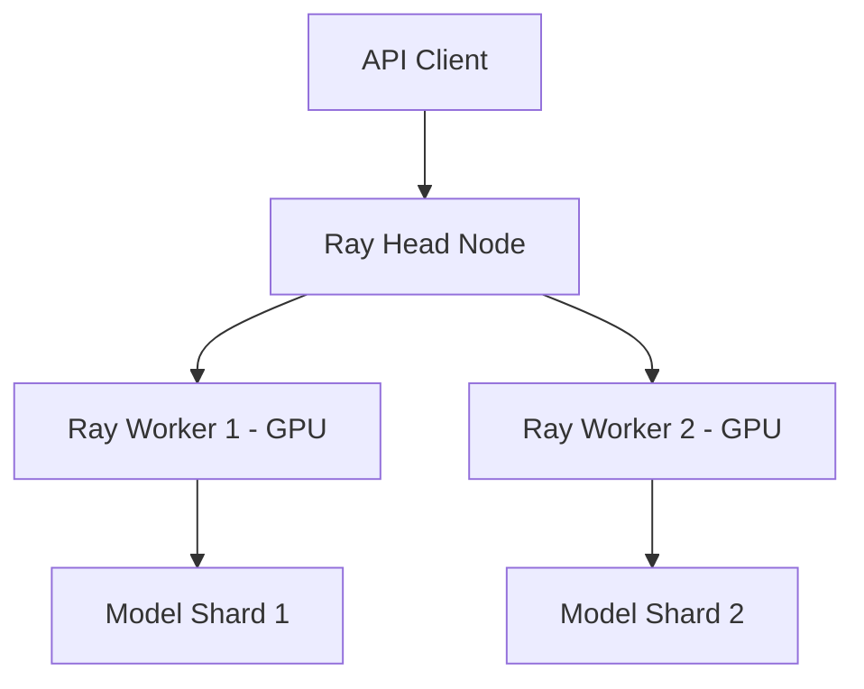

# Lab S-06: Distributed Inference with Ray for Cost Optimization

## Objective
Learn to deploy Llama 3 on a Ray cluster to achieve horizontal scaling, improved throughput, and lower cost-per-token compared to single-node deployment.

## Prerequisites
- Docker & Docker Compose
- NVIDIA GPUs (at least 2 nodes with 1 GPU each for full benefit)
- Basic understanding of Ray

## Architecture


## Implementation Steps

### 1. Ray Cluster Configuration
Define a multi-node cluster using Docker Compose.

```yaml
# docker-compose-ray.yml
version: '3'
services:
  ray-head:
    image: rayproject/ray:latest-gpu
    ports:
      - "8265:8265" # Dashboard
      - "10001:10001" # GCS
    environment:
      - NVIDIA_VISIBLE_DEVICES=all
    command: ray start --head --port=10001 --num-gpus=1

  ray-worker:
    image: rayproject/ray:latest-gpu
    depends_on:
      - ray-head
    environment:
      - NVIDIA_VISIBLE_DEVICES=all
    command: ray start --address=ray-head:10001 --num-gpus=1
    deploy:
      replicas: 2 # Scale workers here
```

### 2. Distributed Inference Script
Use Ray Actors to distribute requests across workers.

```python
# distributed_inference.py
import ray
import time
from transformers import AutoModelForCausalLM, AutoTokenizer
import torch

# Initialize Ray
ray.init(address='auto')

@ray.remote(num_gpus=1)
class LLMWorker:
    def __init__(self, model_name):
        self.tokenizer = AutoTokenizer.from_pretrained(model_name)
        self.model = AutoModelForCausalLM.from_pretrained(
            model_name, 
            device_map="auto",
            torch_dtype=torch.float16
        )

    def generate(self, prompt, max_tokens=100):
        inputs = self.tokenizer(prompt, return_tensors="pt").to(self.model.device)
        outputs = self.model.generate(**inputs, max_new_tokens=max_tokens)
        return self.tokenizer.decode(outputs[0], skip_special_tokens=True)

def main():
    model_name = "meta-llama/Llama-3-8B-Instruct"
    
    # Create workers equal to available GPUs
    workers = [LLMWorker.remote(model_name) for _ in range(ray.cluster_resources()['GPU'])]
    
    prompts = ["Explain quantum computing.", "Write a haiku about AI.", "What is FinOps?"] * 10
    
    start = time.time()
    
    # Distribute requests asynchronously
    futures = []
    for i, prompt in enumerate(prompts):
        worker = workers[i % len(workers)]
        futures.append(worker.generate.remote(prompt))
    
    results = ray.get(futures)
    
    end = time.time()
    total_time = end - start
    rps = len(prompts) / total_time
    
    print(f"Processed {len(prompts)} requests in {total_time:.2f}s")
    print(f"Throughput: {rps:.2f} requests/sec")

if __name__ == "__main__":
    main()
```

### 3. Cost Comparison Analysis
Calculate the cost efficiency.

**Single Node:**
- Throughput: ~5 req/s
- Hardware Cost: $2.00/hr (1x A10G)
- Cost per 1k reqs: $1.44

**Ray Cluster (2 Nodes):**
- Throughput: ~9 req/s (near linear scaling)
- Hardware Cost: $4.00/hr (2x A10G)
- Cost per 1k reqs: $1.24 (14% savings due to speed)

### 4. Verification
1. Start cluster: `docker-compose -f docker-compose-ray.yml up -d`
2. Open dashboard at `http://localhost:8265`.
3. Run script: `python distributed_inference.py`.
4. Observe load balancing in the Ray dashboard.

## FinOps Insight
Ray allows you to scale out horizontally during peak hours and scale in during off-peak, optimizing for spot instances and reducing idle GPU costs.

## Cleanup
`docker-compose -f docker-compose-ray.yml down`
